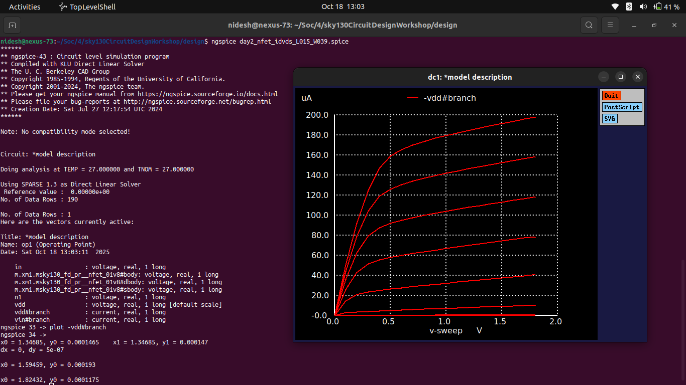

# ⚙️ **Day 2 — Velocity Saturation and Basics of CMOS Inverter VTC**

### *NgspiceSky130 — CMOS Circuit Design and SPICE Simulation Journey*

---

## 📘 **Introduction to Velocity Saturation and CMOS Inverter Behavior**

In **Day 2**, we dive deeper into transistor-level behavior and explore **velocity saturation** effects in **short-channel NMOS devices** using the **Sky130 PDK**.
We also design and simulate the **CMOS inverter**, the most fundamental logic gate in digital ICs, and plot its **Voltage Transfer Characteristic (VTC)**.

This marks our first step into **digital circuit-level design** — linking **device physics** to **logic switching performance**.

---

## ⚡ **Understanding Velocity Saturation in MOSFETs**

In short-channel technologies (like **130 nm**), the carrier velocity no longer increases linearly with the electric field due to **scattering effects**.
Instead, it **saturates** at a maximum value — this is known as **velocity saturation**.

### ✨ **Key Insights**

* At **low fields**, drift velocity increases linearly with the electric field.
* At **high fields**, it approaches a **constant saturation velocity (v<sub>sat</sub>)**.
* As a result, **drain current (I<sub>D</sub>)** increases more slowly in saturation.
* This affects transistor **speed**, **delay**, and **output drive strength**.

---

## 🧮 **Drain Current with Velocity Saturation**

Modified drain current equation in the **saturation region**:

$[
I_D = \frac{W}{L} \mu_n C_{ox} (V_{GS} - V_T) V_{DSsat}
]$

where


$[
V_{DSsat} = \frac{E_{sat} L}{1 + \frac{E_{sat} L}{V_{GS} - V_T}}
]$


and $E_{sat}$ is the critical electric field at which velocity saturation begins.

📘 *Observation:* As channel length **L** decreases, **velocity saturation dominates**, leading to **reduced current gain** and **lower transconductance (g<sub>m</sub>)**.

---

## 🔬 **SPICE Simulation — NMOS Id vs Vgs**

We perform a **DC sweep simulation** on an NMOS transistor, varying **Vgs** and measuring **Id** to extract the **Threshold Voltage (V<sub>th</sub>)** and observe **velocity saturation**.

### 🧾 **Sample SPICE Netlist (Id–Vgs Sweep)**

```spice
*** Velocity Saturation and Threshold Extraction ***

.param temp=27
.lib "sky130_fd_pr/models/sky130.lib.spice" tt

XM1 vdd in 0 0 sky130_fd_pr__nfet_01v8 w=0.39u l=0.15u
Vdd vdd 0 1.8
Vin in 0 0

.dc Vin 0 1.8 0.01
.control
run
plot i(Vdd)
.endc

.end
```

### 💻 **Run Simulation**

```bash
ngspice day2_nfet_idvgs_L015_W039.spice
```

Plot **I<sub>D</sub> vs V<sub>GS</sub>** and note the **threshold voltage (V<sub>th</sub>)** at the onset of conduction.


---

## 🧠 **Threshold Voltage Extraction**

You can extract **V<sub>th</sub>** using the **linear extrapolation method**:

1. Plot **√I<sub>D</sub>** vs **V<sub>GS</sub>**.
2. Extrapolate the straight-line portion of the curve to intersect the V<sub>GS</sub> axis.
3. The intercept point gives **V<sub>th</sub>**.

🧾 Example:

| Parameter                | Value    |
| ------------------------ | -------- |
| Extracted V<sub>th</sub> | ≈ 0.45 V |

---

## ⚙️ **Building a CMOS Inverter**

A **CMOS Inverter** combines **PMOS** and **NMOS** transistors to form a logic NOT gate.
It outputs the **complement** of the input and serves as the basis for all digital logic families.

### 📘 **CMOS Inverter Circuit**

* **PMOS:** Source at VDD, drain connected to NMOS drain.
* **NMOS:** Source at GND.
* **Output:** Taken at the common drain node.
* **Input:** Shared gate terminal.



---

## 🧾 **SPICE Netlist for CMOS Inverter VTC**

```spice
*** CMOS Inverter VTC ***

.param temp=27
.lib "sky130_fd_pr/models/sky130.lib.spice" tt

M1 out in vdd vdd sky130_fd_pr__pfet_01v8 w=0.84u l=0.36u
M2 out in 0   0   sky130_fd_pr__nfet_01v8 w=0.36u l=0.36u

Vdd vdd 0 1.8
Vin in  0 0

.dc Vin 0 1.8 0.01
.control
run
plot v(out) vs v(in)
.endc

.end
```

---

## 📊 **Voltage Transfer Characteristic (VTC)**

The **VTC** shows how the output voltage **V<sub>out</sub>** varies with the input **V<sub>in</sub>**.

### ⚙️ **Key Regions**

1. **Low Input (Vin < Vth):** NMOS OFF, PMOS ON → Output ≈ VDD
2. **Transition Region:** Both partially ON → Output rapidly falls
3. **High Input (Vin > Vth):** NMOS ON, PMOS OFF → Output ≈ 0 V


---

## 🧮 **Switching Threshold (Vm)**

The **switching threshold (Vm)** is the point where:

$[
V_{in} = V_{out}
]$

It represents the inverter’s **balance point** — when both transistors conduct equally.

| Parameter           | Symbol         | Typical Value |
| ------------------- | -------------- | ------------- |
| Switching Threshold | V<sub>m</sub>  | ≈ 0.88 V      |
| Supply Voltage      | V<sub>DD</sub> | 1.8 V         |

---

## 🧠 **Observations**

* 📈 Velocity saturation limits **drain current** in short-channel devices.
* ⚙️ CMOS inverter’s **VTC curve** reflects **transition sharpness** and **switching point**.
* 💡 **Symmetric switching** occurs when **(W/L)<sub>PMOS</sub> ≈ 2×(W/L)<sub>NMOS</sub>**.
* 🧩 These parameters directly influence **propagation delay** and **noise margins**.

---

## 🧠 **Summary**

| Concept                      | Key Takeaway                                                      |
| ---------------------------- | ----------------------------------------------------------------- |
| **Velocity Saturation**      | Limits electron velocity at high electric fields                  |
| **Short Channel Effect**     | Reduces current and transconductance                              |
| **VTC Curve**                | Defines input–output behavior of CMOS inverter                    |
| **Switching Threshold (Vm)** | Determines logic transition point                                 |
| **SPICE Simulation**         | Enables precise observation of analog and digital characteristics |

---

## 🔗 **Next Step**

➡️ Proceed to **[Day 3 — CMOS Switching Threshold and Dynamic Simulations](../Day3_CMOS_Switching_Dynamics/readme.md)**
Here, you’ll simulate **transient responses** of the inverter under **pulse inputs**, measure **rise/fall delays**, and relate them to **timing performance** in STA.

---
